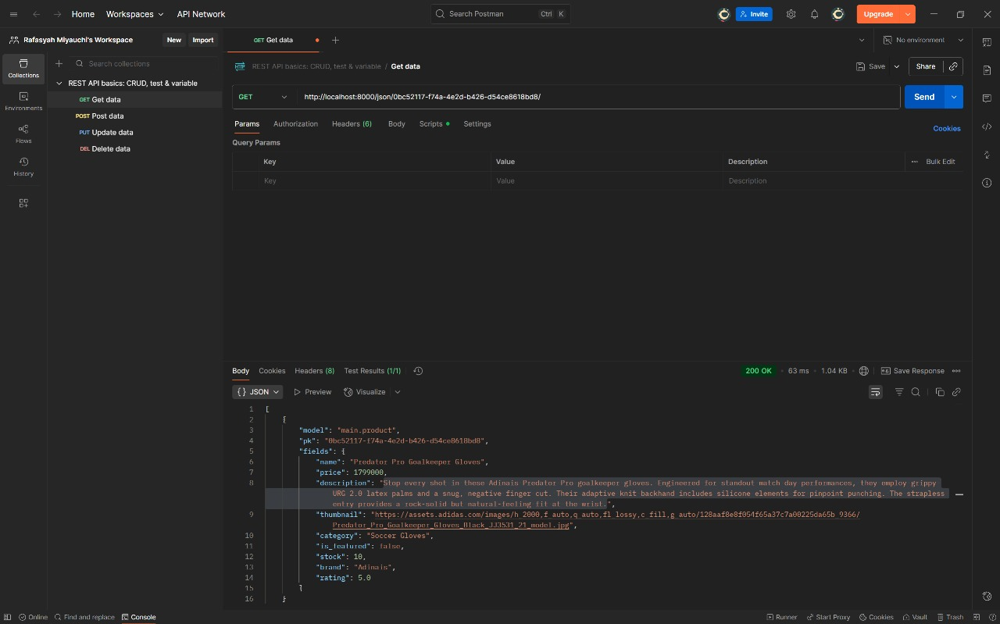
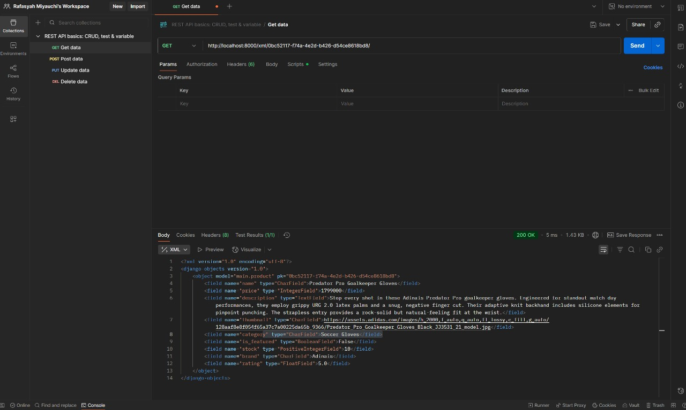

# ⚽ Adinais Football Shop
Welcome to my first individual assignment, my very own football shop for Adinais Football Brand! This project is supposedly a fully functional web application built with Django for the Platform-Based Programming course. For now it has barely anything ☺️

**Live Application Link**: [CLICK LINK](https://rafasyah-miyauchi-adinaisfootball.pbp.cs.ui.ac.id/)

## So, How Was This Made?

Here's a quick rundown of the steps I took to get this thing up and running:

1. **Getting Started**: First things first, I set up a new Django project and an app called main to hold all the important stuff.

2. **The Database Blueprint (models.py)**: Then, I defined the Product model in models.py. This is basically the blueprint for every item in the shop, telling Django what info to store, like the name, price, description, etc.

3. **The Logic (views.py)**: The views.py file is where the main logic happens. 

4. **The Fun Part (main.html)**: This is the actual webpage! For now it is the bare minimum but later it will look better!

5. **Making it Work (urls.py)**: To make sure the pages actually show up, I set up the routing in urls.py. This connects the URLs you type in the browser to the right view function.

6. **Going Live (PWS Deployment)**: Finally, I deployed the whole thing to PWS so anyone can check it out online.

##  MVT Architecture Diagram

The Model-View-Template (MVT) pattern in Django handles web requests in a structured way.

    [SOURCE](https://python.plainenglish.io/the-mvt-design-pattern-of-django-8fd47c61f582)

1. You type in the URL, where your browser then sends a an HHTP request to the server.

2. The `urls.py` in the project folder catches it.

3. The app's `urls.py` takes over. It will then matches the URL to the show_main function in `views.py`.

4. The views.py function does the work. It basically processes the request. It can interact with the `models.py` to get data from the database. It then bundles this data into a `context` dictionary.

5. The template file (main.html) makes it pretty. This works because the view calls the `render()` function, which combines the specified HTML template with the `context` data. The template placeholders `{{ }}` are filled with the data.

6. Finally, Django sends the final, rendered HTML back to the user's browser, which displays the web page.

## Assignment 1 Questions:

### What is the role of `settings.py`?
The `settings.py` file is the central configuration hub for a Django project. It contains all the settings that define how the project runs. It includes:
* `INSTALLED_APPS`: A list of all applications that are active in the project.
* `DATABASES`: Configuration for connecting to databases (like SQLite for development or PostgreSQL for production).
* `SECRET_KEY`: A unique key for cryptographic signing.
* `DEBUG`: A boolean that toggles debug mode, showing detailed error pages when set to `True`.
* `ALLOWED_HOSTS`: A list of domains that are allowed to serve the Django application.

### How does database migration work in Django?
Database migration is Django's system for updating the database schema to match the application's models. To my knowledge, it's basically a two step process where,
1.  **`python manage.py makemigrations`**: This command basically inspects your `models.py` files for any changes (like adding a field or a new model) and creates a new "migration file." This file is essentially a Python script containing instructions on how to apply those changes to the database.
2.  **`python manage.py migrate`**: Finally this command finds all unapplied migration files and executes them in order. It translates the Python instructions into SQL commands and runs them against the database, thus updating the database schema.

### Why was Django chosen as a starting point?
I think Django is chosen as a starting point for the convenient aspect of database development due to its philosophy and its ease of use. Two in paticular are ORM (Object-Relational-Mapping) which essentially simplifies database interactions, and a Model-View-Template (MVT) architecture which organizes the application into thre distinch layers. 

### Feedback for Tutorial 1
I have personally no issue with Tutorial 1, but one aspect that makes it less effective was the fact that it was held online making communication and problem solvig requires us to share our screen which is a bit of an inconveniences especially during debugging stage

## Assignment 2 Questions:

### Purpose of Data Delivery during Platform Implementatition
We need data delivery because modern applications are rarely built as a single piece. A universal format like JSON or XML acts as a common language. It allows the backend (our Django app) to "serialize" its data, sending it in a way that any frontend, be it a web browser, a mobile app, or even another server, can easily understand and work with.

### XML or JSON? Why is JSON more popular?
I personally prefer JSON for the same reason why it may be more popular than XML. First it's more readable, cleaner syntax and python dictionaries, it's more intuitive to me. It's more popular also because of the fact that it is lightweight.

### Purpose of is_valid() method and why do we need it?
The is_valid() method acts as a crucial security and data checkpoint. For example, when a form is submitted, the data is just raw text that we can't trust. is_valid() runs a series of checks on this data against the rules defined in our model and form. 

### Purpose of csrf_token?
It's basically a security feature that protects against Cross-Site Request Forgery (CSRF) attacks. A CSRF attack tricks a logged-in user into unknowingly submitting a malicious request on a website they trust. The csrf_token prevents this by placing a unique, secret token in every form. When the form is submitted, the server checks if the submitted token matches the one it issued. The attacker's fake form won't have this correct token, so Django will reject the malicious request, protecting the user.

### The Process to Assignment 2
Well, mostly I followed the breakdown from the Tutorial 2, but I went from models.py to check what are the data structure, then for this assignment 3, I start from the forms.py making sure to match it with the models.py. The important steps, which is the first point of this assignment is on views.py where I make 4 functions correlating with xml and json. In urls.py I then mapped each view to a specific URL, making the application's features accessible to users. Finally, I built the HTML templates to create the user interface, using Django's template language to dynamically display the data from the views.

### Feedback to TAs for Tutorial 2
I have no feedback for the tutorial 2, other than cross checking the information within the website to ensure that there are no error cause by syntax in the tamplate.

## Postman API Test Results

Here are the results of testing the data delivery endpoints.

### 1. Get All Products (JSON)

### 2. Get All Products (XML)

### 3. Get Product by ID (JSON)

### 4. Get Product by ID (XML)

## Assignment 3 Questions:

### What is Django's AuthenticationForm? Explain its advantages and Disadvantages
It's a built in class from Django to handles anything about user login. It is a way to validates a user's credentials such as their username and password (what this website use) with the databases. The main advantage of AuthenticationForm is how it has a built-in security where it may handle most security checks automatically and error handling without us writing boilerplate code for a login form. The main disadvantage of AuthenticationForm is it's the bare minimum meaning it has limited customization and genereic appearance. For example, if we want to login with an email address, we must override its method. 

### What is the difference between authentication and authorization? How does Django implement the two concepts?
Authentication is the process of verifying who a user is. Whereas, Authorization is the process of verifying what an authenticated user is allowed to do. Within Django, it has a built in framework called django.contrib.auth to handle both aspect. Authentication is managed via the User model, middleware, and helper functions like authenticate() (to check credentials) and login() (to create a session for the user). While authorizaiton is handled by a built-in permission and groups system and decorator.

### What are the benefits and drawbacks of using sessions and cookies in storing the state of a web application?
To start, a cookie is a small data stored on the user's browser whereas a session is a mechanism to store user-specific data on the server. The main benefits is state management like personalized content and user logins sectios. Another is Security (sessions) where you can store sensitive infromation in a server-side session. The drawbacks are first the limited Size (Cookies), where it is limited to a small size (around 4KB), so they cannot be used to store large amounts of data. Whereas server Load (Sessions) where each active session consumes server memory and/or storage. For example, on a website with millions of active users, this can become a significant performance and scalability bottleneck.

### In web development, is the usage of cookies secure by default, or is there any potential risk that we should be aware of? How does Django handle this problem?
No, the usage of cookies is not secure by default. There are a couple, but from what I learned in the slides, the two are regardingt Cross-Site Scripting (XSS) and Cross-Site Request Forgery (CSRF). XSS is a vulnerability that allows someone to inject JavaScript code that will be executed by the client. The potential problem with this vulnerability is that an attacker could steal cookies from users who are already logged into a website. Whereas CSRF could happen when an attacker tricks a logged-in user into clicking a link that performs an unwanted action on a website they are authenticated with. The browser will automatically include the authentication cookie with the request, making the malicious request seem legitimate to the server.

For CSRF, Django has a built-in CSRF protection framework. It works by adding a hidden csrfmiddlewaretoken field to POST forms. This token is unique to each user session. On submission, Django verifies this token, ensuring the request originated from the site itself and not from a malicious third-party source.

For XSS, Django’s Built in Security Features Cross Site Scripting (XSS) Protection. Using Django templates protects us against the majority of XSS attacks. Additionally, we can also use is_valid() in Django templates, forms.py and views.py

### Explain how you implemented the checklist above step-by-step (not just following the tutorial).
There are three documents that I am mostly working on, the first and foremost is my views.py, where I implemented register, login_user and logout for the authentication. After I do that, I worked on mapping each authentication view to a specific URL path to make it accessible from the browser. A few adjustment to the templates (html documents) to facilitate the authentication process such as the login.html and register.html. In addition to that I also added decorate @login_required(login_url='/login') to the show_main view to redirect any unauthenticated users to the login page. To finalize I update the model and view logic where in models.py I added ForeignKey relationship to the Product model, whilst editing the create_product in views.py in order to automatically assin the currently logged-in user to any new product being created. I tested all the changes in my local house by creating an account and trying the filter, session and cookies feature